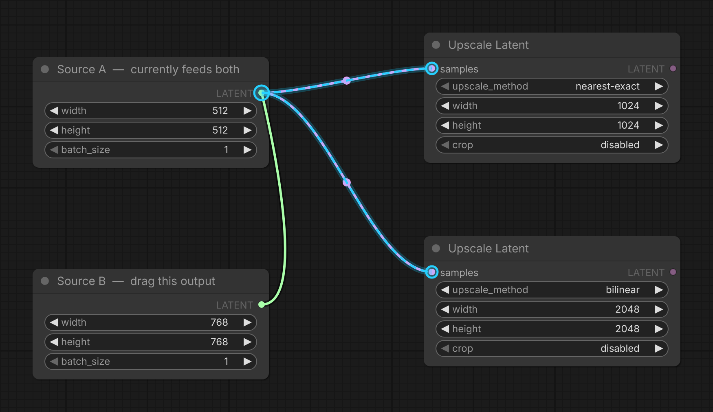

# comfyui-output-swap

Drag one output onto another to take over its downstream links — reroute a connection's source without hunting for the target input.

> Part of a family of mobile-first ComfyUI usability packs
> ([gallery-loader](https://github.com/laurigates/comfyui-gallery-loader),
> [sampler-info](https://github.com/laurigates/comfyui-sampler-info)):
> touch-friendly gestures and HTML modals that replace clunky native
> LiteGraph interactions, additive and non-clobbering.

## Install

```sh
cd <ComfyUI>/custom_nodes
git clone https://github.com/laurigates/comfyui-output-swap
cd comfyui-output-swap
bun install
bun run build      # emit web/dist/ (served by ComfyUI)
```

Restart ComfyUI; hard-refresh the browser tab (Ctrl+Shift+R / Cmd+Shift+R).

## What it does

Redirecting a connection's **source** normally means hunting down the
downstream node — often scrolled off-screen — grabbing the wire there, and
dragging it back. This pack lets you do it from the source end instead.

**Drag one output onto another node's output slot of the same type.** The
dragged output takes over *all* of that output's downstream links — every
input it fed is re-homed to the dragged source — and the old output is left
disconnected. (An input holds only one link, so each re-home cleanly replaces
the old one.)

**If the dragged node has a matching free input, it is also spliced into the
stream** — the taken-over output is wired into it, giving `target → dragged →
everything the target used to feed`. Dropping a filter or upscaler onto a
loader's output puts it in the middle of the chain in one gesture, instead of
leaving its input dangling.

The splice is deliberately cautious, because guessing wrong would silently
rewire a graph you didn't ask to touch. It only happens when:

- the dragged node has **exactly one** input of a compatible type — `image1`/
  `image2` pairs are ambiguous, so those fall back to a plain takeover;
- that input is **empty** — it will never displace a connection you already made;
- neither slot is a wildcard (`*`) type — reroutes and "any" switches would
  otherwise match everything;
- and the result would not create a **cycle**.

Otherwise you get the plain takeover. Hold **Alt** while dropping to skip the
splice for one gesture (when you want the old branch left dangling and out of
the execution path), or turn it off entirely with the **Also splice the dragged
node into the stream** setting, under **Settings → Touch Tools → Output Swap**.

While you drag, a hover affordance shows exactly what will happen: a cyan ring
on the takeover-target output, dashed cyan wires to each downstream input, a
ring on each of those (possibly off-screen) input endpoints, and — when the
splice applies — a finer-dashed wire back into the input it will fill. Dropping
anywhere that isn't an output slot does nothing special — native behavior
runs — and the whole feature toggles off via the **Output swap** setting.

Additive and fail-soft: it hooks the canvas connection event without clobbering
other extensions, coexists with `quick-connections` (Circuit Board Lines), and
only ever moves the links you asked it to.



*Mid-drag from Source B's output onto Source A's: the cyan ring marks the
takeover target, and the dashed cyan wires trace every downstream input that is
about to be re-homed — each ringed at its far end, so targets scrolled off
screen are still accounted for. Releasing here moves both links to Source B and
leaves Source A's output empty.*

## Compatibility

- ComfyUI: modern Vue frontend (`comfyui-frontend-package >= 1.43`) for the
  `canvas.linkConnector` event API the swap hooks. Verified against 1.45.x.
- Coexists with `quick-connections` (Quick Connections / Circuit Board Lines).
- Frontend changes take effect after `bun run build` + a browser hard-refresh —
  no ComfyUI restart.

## License

MIT — see `LICENSE`.
